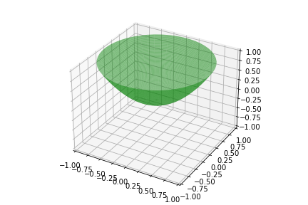
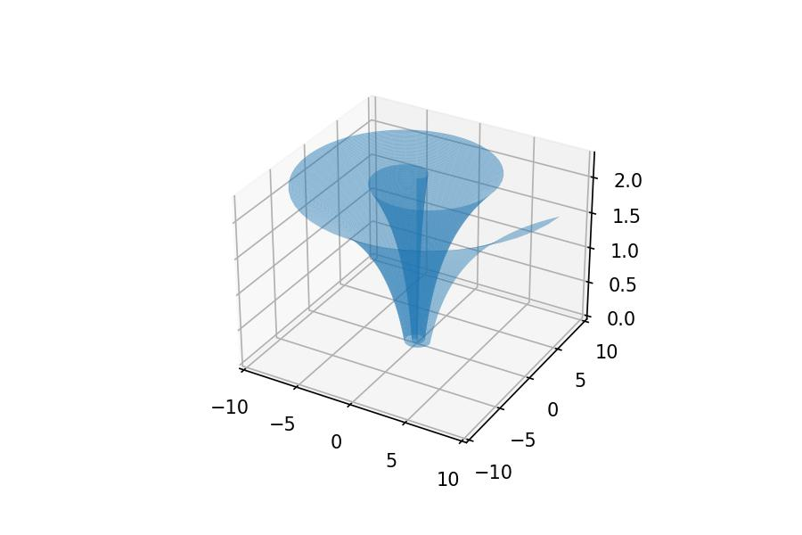

[](https://github.com/ckesanapalli/curve2mesh/actions/workflows/python-app.yml)
[](https://github.com/ckesanapalli/curve2mesh/actions/workflows/python-publish.yml)
[](https://github.com/ckesanapalli/curve2mesh/actions/workflows/python-package.yml)

# curve2mesh

## Overview

`curve2mesh` is a Python module designed for generating 3D meshes from 2D curves. This module simplifies the process of revolving a 2D curve around the Z-axis to create a 3D mesh. It is optimized for performance with NumPy, but also works with standard Python math operations when NumPy is not available.

## Features

- **Ease of Use**: Simple interface for revolving 2D curves.

- **Performance**: Optimized with NumPy for efficient computation.
- **Fallback Compatibility**: Works with standard Python math operations in the absence of NumPy.
- **Flexible**: Suitable for a wide range of applications in graphics, modeling, and educational purposes.

## Installation

To install `curve2mesh`, simply run the following command:

```bash
pip install curve2mesh
```

Or Install directly from Github using

```bash
pip install git+https://github.com/ckesanapalli/curve2mesh
```

**Note**: NumPy is an optional dependency but is recommended for performance enhancement.

## Usage

### Circular Revolve
Here's a basic example of how to use curve2mesh:

```python
from curve2mesh import revolve_curve
import numpy as np
import matplotlib.pyplot as plt
from mpl_toolkits.mplot3d.art3d import Poly3DCollection

# Sample 2D curve coordinates
x = np.linspace(0, 1, 100)
z = x ** 2  # Example curve (parabola)

# Revolve the curve
angle_count = 50
faces = revolve_curve(x, z, angle_count, revolve_angle=2*np.pi)

# Plotting
fig = plt.figure()
ax = fig.add_subplot(111, projection='3d')
ax.add_collection3d(Poly3DCollection(faces, facecolors='g', linewidths=1, alpha=0.5))
ax.set_xlim(-x.max(), x.max())
ax.set_ylim(-x.max(), x.max())
ax.set_zlim(z.min(), z.max())
plt.show()
```



### Revolve Along Path
Here's an example using revolve path curve
```python
from curve2mesh import revolve_curve_along_path
import numpy as np
import matplotlib.pyplot as plt
from mpl_toolkits.mplot3d.art3d import Poly3DCollection

x = np.linspace(1, 10, 100)
z = np.log(x)
main_curve = np.array([x, z]).T

angle_rad = np.linspace(0, 4*np.pi, 100)
radius = angle_rad/10
revolve_path = np.array([angle_rad, radius]).T

revolved_mesh = revolve_curve_along_path(main_curve, revolve_path)

fig = plt.figure()
ax = fig.add_subplot(111, projection='3d')
ax.add_collection3d(Poly3DCollection(revolved_mesh, alpha=0.5))
ax.set_xlim(-x.max(), x.max())
ax.set_ylim(-x.max(), x.max())
ax.set_zlim(z.min(), z.max())
plt.show()

```


## Requirements

- Python 3.7+
- NumPy (optional but recommended)

## Contributing

Contributions to `curve2mesh` are welcome! Please read our [Contributing Guidelines](CONTRIBUTING.md) for details on how to submit pull requests, bug reports, and feature requests.

## License

This project is licensed under the MIT License - see the [LICENSE](LICENSE) file for details.

## Authors

Chaitanya Kesanapalli
